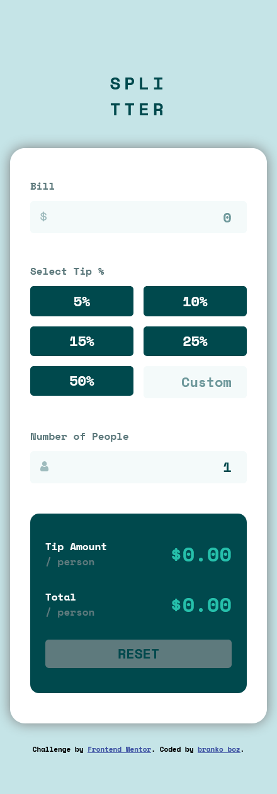
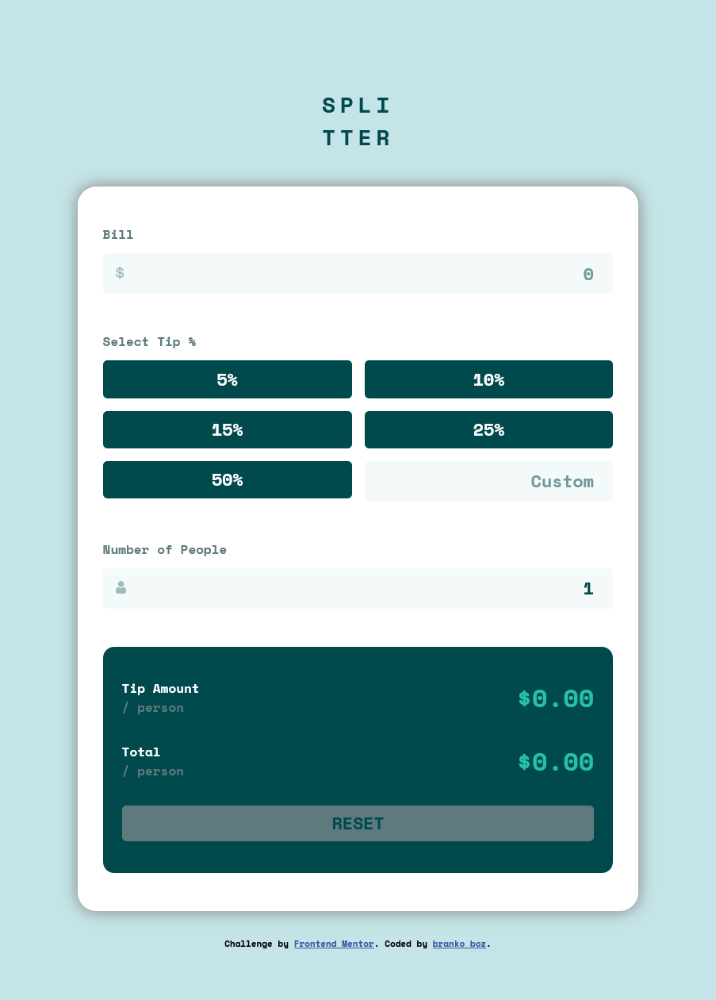
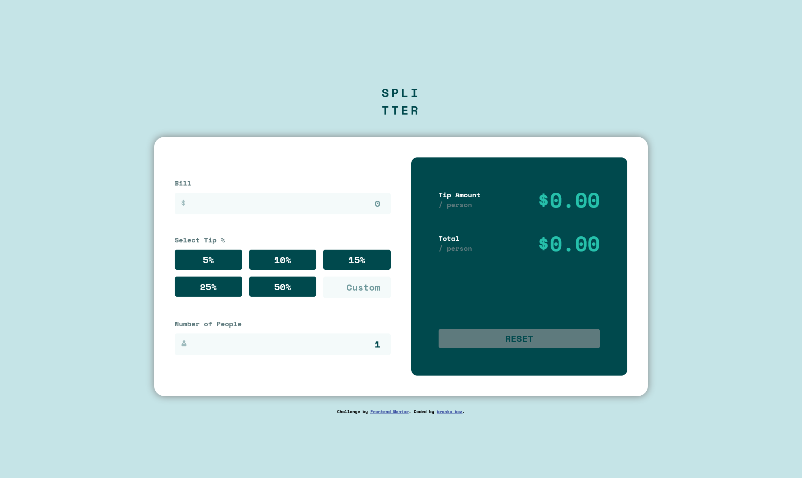
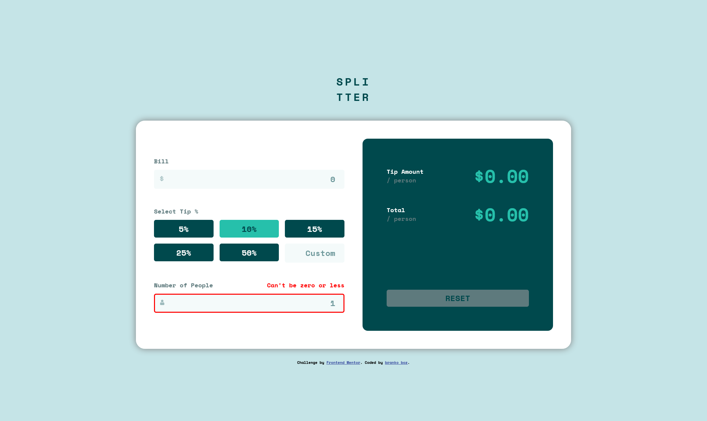

# Frontend Mentor Challenge - Tip calculator app

Solution to the [Frontend Mentor challenge](https://www.frontendmentor.io/challenges/tip-calculator-app-ugJNGbJUX).

## The Challenge

Challenge is to build out tip calculator app and get it looking as close to the design as possible.

This small app is perfect for anyone starting to get to grips with JavaScript. The calculator functionality is a nice test! Your users should be able to:

- View the optimal layout for the app depending on their device's screen size
- See hover states for all interactive elements on the page
- Calculate the correct tip and total cost of the bill per person

## Links

- [Code](https://github.com/brankobozo/tip-calculator-app)
- [live](https://brankobozo.github.io/tip-calculator-app/)

## Tools

- Semantic HTML5 markup
- JS Classes
- CSS Grid and flexbox
- CSS Custom properties

## Screenshots

